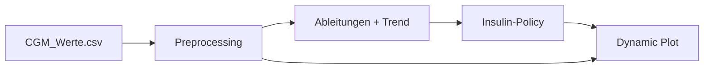

# HSLU TA.DIGITALTWIN – Glucose-Insulin Digital Shadow

Semester-Projekt im Modul **TA.DIGITALTWIN – Digital Twins**
Hochschule Luzern, Technik & Architektur.

## Projekt Ziel

Das Projekt modelliert einen **Digital Shadow** auf Basis realer CGM-Daten aus `data/CGM_Werte.csv`. Die App zeigt keine große Regleroberfläche mehr, sondern zwei einfache UseCases:

- UseCase 1: das System dosiert Insulin autonom
- UseCase 2: der Patient dosiert zuerst selbst, dann greift das System ein

Die Entscheidung basiert auf dem aktuellen Glukoseverlauf, der ersten und zweiten Ableitung sowie einer kurzen Vorhersage.

```
Input:  CGM-Zeitreihe [mmol/L]
Output: Insulinentscheidung + Visualisierung
```

## Aktueller Ansatz

Die Codebasis ist absichtlich klein und nachvollziehbar gehalten:

- reale CGM-Zeitreihe laden und glätten
- erste und zweite Ableitung berechnen
- daraus direkt eine Insulinzeitreihe berechnen
- Messung und Insulinentscheidung gemeinsam plotten

Die medizinische Wirkung des Insulins wird nicht validiert. Das Projekt ist deshalb ein Digital Shadow und kein vollständiger Digital Twin.

## Projektstruktur

```
src/glucose_insulin/
    model.py          – direkte CGM-zu-Insulin-Policy
    preprocessing.py  – CGM laden, glätten, ableiten
    plotting.py       – dynamische Visualisierung
tests/
    test_model.py
    test_preprocessing.py
demo.py              – einfache Demo für beide UseCases
app.py               – Streamlit-Oberfläche mit echter Zeitreihe
```

## Setup

```bash
conda activate dgtwins
pip install -r requirements.txt
```

## Starten

```bash
python demo.py
streamlit run app.py
```

## Run Tests

```bash
pytest
```

## Wichtige Dateien

- `app.py` - Streamlit-App mit zwei UseCases
- `demo.py` - einfache lokale Demo
- `src/glucose_insulin/preprocessing.py` - Laden und Vorverarbeiten der CGM-Zeitreihe
- `src/glucose_insulin/model.py` - direkte CGM-zu-Insulin-Policy
- `src/glucose_insulin/plotting.py` - dynamische Visualisierung

## Modellfluss



## Code Style

Google Python Style Guide · Black (line-length 79) · mypy strict · pylint
