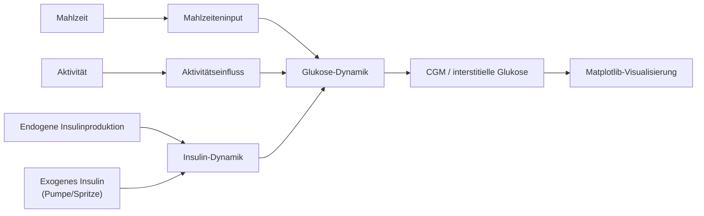

# HSLU TA.DIGITALTWIN – Glucose-Insulin Digital Twin

Semester-Projekt im Modul **TA.DIGITALTWIN – Digital Twins**
Hochschule Luzern, Technik & Architektur.

## Project Ziel

Modell den Einfluss einer Mahlzeit auf **Blutzucker- und Insulinwerte** currently using a low-order grey-box compartment model (E-DES).  
A CGM (Continuous Glucose Monitoring) patch measures interstitial glucose as the system output.

```
Input:  meal glucose equivalent  [mmol]
Output: interstitial glucose     [mmol/L]  (CGM measurement)
```

## Geplanter Umsetzungsansatz

Ziel ist ein Modell, das für einen einfachen T1D-Use-Case verständlich bleibt und später leicht angepasst werden kann. Deshalb werden die Einflüsse getrennt als Eingänge modelliert:

- endogenes Insulin aus der körpereigenen Restproduktion
- exogenes Insulin aus Pumpe oder Spritze
- Mahlzeiteninput
- Aktivitätseinfluss

Ein möglicher, didaktisch einfacher Start für die Differentialgleichungen ist:

```text
dI/dt = k3 * (G - Gb) - k4 * (I - Ib) + I_endogen + I_exogen
dG/dt = -k1 * (G - Gb) - k2 * (I - Ib) + Essen - Aktivität
```

Dabei gilt:

- `G`: Glukosekonzentration [mmol/L]
- `I`: Insulinkonzentration [pmol/L]
- `Gb`: Basalwert Glukose [mmol/L]
- `Ib`: Basalwert Insulin [pmol/L]
- `k1`: insulinunabhängiger Glukoseabbau
- `k2`: Insulineffekt auf Glukose
- `k3`: Glukoseantwort auf Insulin-Regelung
- `k4`: Insulinabbau

Wichtig für die Interpretation:

- `Gb` und `Ib` sind Referenzwerte, nicht zusätzliche Quellen.
- `I_endogen` ist die körpereigene Restproduktion.
- `I_exogen` ist die Insulingabe von außen.
- `Essen` und `Aktivität` werden später als eigene Eingangsfunktionen
    modelliert, damit der Use-Case austauschbar bleibt.

Für den ersten Python-Ausbau ist die Empfehlung:

1. Mathematik und Begriffe im README sauber festhalten.
2. Modell als kleine, klar getrennte Python-Klassen abbilden.
3. Simulation und Plot mit Matplotlib zuerst umsetzen.
4. Streamlit erst später als optionale Oberfläche ergänzen.

Diese Reihenfolge hält den Code überschaubar und gut erklärbar.

## Milestone-Status (Projektfokus)

| Milestone | Status | Aktueller Stand |
|---|---|---|
| Model Specification & Block Diagram | Teilweise umgesetzt | Ein vereinfachtes ODE-Modell mit dokumentierter Gleichungsform ist implementiert. Ein Blockdiagramm ist im README als Mermaid enthalten. |
| DT Requirements & System Decomposition (5D) | Teilweise umgesetzt | Systemgrenzen und Schnittstellen sind im Code klar getrennt (Model, Simulation, Utils, Plot, App). Eine vollständige 5D-Abbildung ist noch offen. |
| State Machine (insulin pump), Behaviour Models (meal, activity) | Teilweise umgesetzt | Verhaltensmodelle für Mahlzeit und Aktivität sind vorhanden. Eine explizite Zustandsmaschine für die Pumpe ist noch nicht implementiert. |
| Insulin Pump Use Case | Teilweise umgesetzt | Exogenes Insulin ist als separates Eingangsprofil modelliert und interaktiv steuerbar (Demo + Streamlit). Ein fachlich vollständiger Pumpen-Use-Case fehlt noch. |
| State Estimation, Model Validation, Personalisation | Noch offen | Es gibt aktuell keinen Observer/Kalman-Ansatz, keine Parameterschätzung gegen reale Daten und keine Personalisierung. |
| Data Architecture | Noch offen | Datenflüsse, Schnittstellen, Persistenz und Austauschformate sind noch nicht als Architektur spezifiziert. |
| Full 5D Digital Twin Integration | Noch offen | Integrationsschicht über Modell, Daten, Dienste und Use-Case-Orchestrierung ist noch nicht aufgebaut. |

## Nächste Schritte (Priorität)

1. Pumpen-Zustandsmaschine ergänzen (z. B. Basal, Bolus, Pause, Fehler) und diese als klar getrenntes Modul in die Simulation einkoppeln.
2. Validierungspipeline aufbauen: Referenzszenarien definieren, Sollkurven/Benchmarks festlegen und automatische Vergleichstests ergänzen.
3. Personalisierung vorbereiten: Parameter-Datei pro Patientenszenario, anschließend einfache Parameterschätzung gegen Messdaten.
4. Datenarchitektur definieren: Eingangs-/Ausgangsformate, Zeitstempelkonzept, Datenspeicherung und Import/Export-Schnittstellen.
5. 5D-Integration schrittweise umsetzen: Modell, Daten, Services, Visualisierung und Use-Case-Workflow in einer konsistenten Struktur zusammenführen.

## Setup

```bash
pip install -r requirements.txt
```

## Run Tests

```bash
pytest
```

## Project Structure

```
src/glucose_insulin/
    __init__.py       – package entry point
    model.py          – ODE model (T1D-Basis mit getrennten Inputs)
    simulation.py     – simulation runner & result dataclass
    utils.py          – unit conversion and input profile helpers
    plotting.py       – Matplotlib visualisation of trajectories
src/config/
    scenarios.py      – zentrale Szenarien und Runtime-Building
    ui_config.py      – zentrale Slider-Konfiguration der App
    metrics.py        – zentrale Ergebnis-Kennzahlen
tests/
    test_model.py     – unit tests for the model
demo.py              – simple end-to-end simulation demo
app.py               – interaktive Streamlit-Oberfläche
```

## Modellfluss



## Wie Wir Starten

```bash
pip install -r requirements.txt
pytest
python demo.py
streamlit run app.py
```

Für eine spätere Demo kann dann ein kleines Skript oder Notebook die
Simulation starten und den Verlauf mit Matplotlib anzeigen.

Die interaktive Variante startet mit Streamlit. Dort können
Mahlzeit, Aktivität, Insulin und Modellparameter über Slider
angepasst werden.

## Minimalbeispiel

```python
from glucose_insulin.model import GlucoseInsulinModel
from glucose_insulin.plotting import plot_simulation
from glucose_insulin.simulation import InputProfiles, SimulationConfig, run_simulation
from glucose_insulin.utils import rectangular_pulse


model = GlucoseInsulinModel()

profiles = InputProfiles(
    activity_rate_fn=lambda t: rectangular_pulse(t, 90.0, 130.0, 0.12),
    exogenous_insulin_rate_fn=lambda t: rectangular_pulse(t, 5.0, 20.0, 0.08),
)

config = SimulationConfig(
    meal_glucose_mmol=65.0,
    duration_min=240.0,
    absorption_rate_min=30.0,
    n_points=500,
)

result = run_simulation(model, config=config, profiles=profiles)
plot_simulation(result)
```

## Code Style

Google Python Style Guide · Black (line-length 79) · mypy strict · pylint
